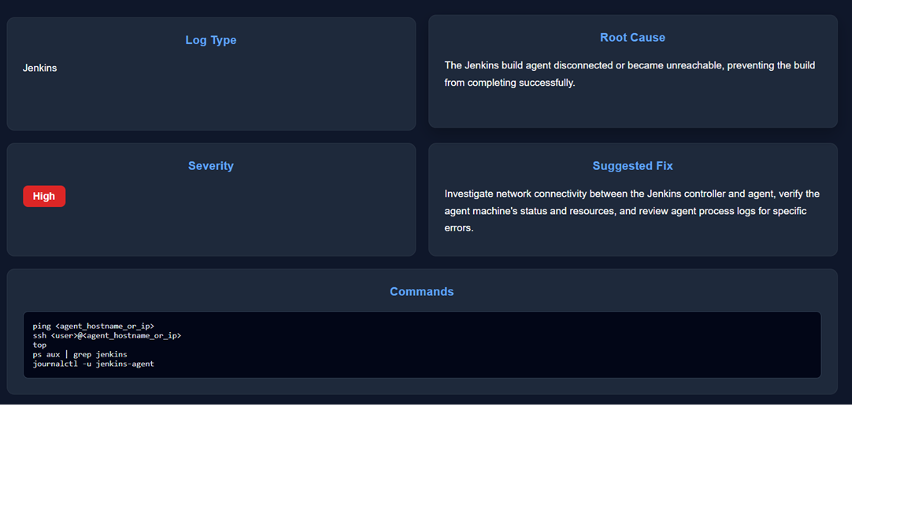
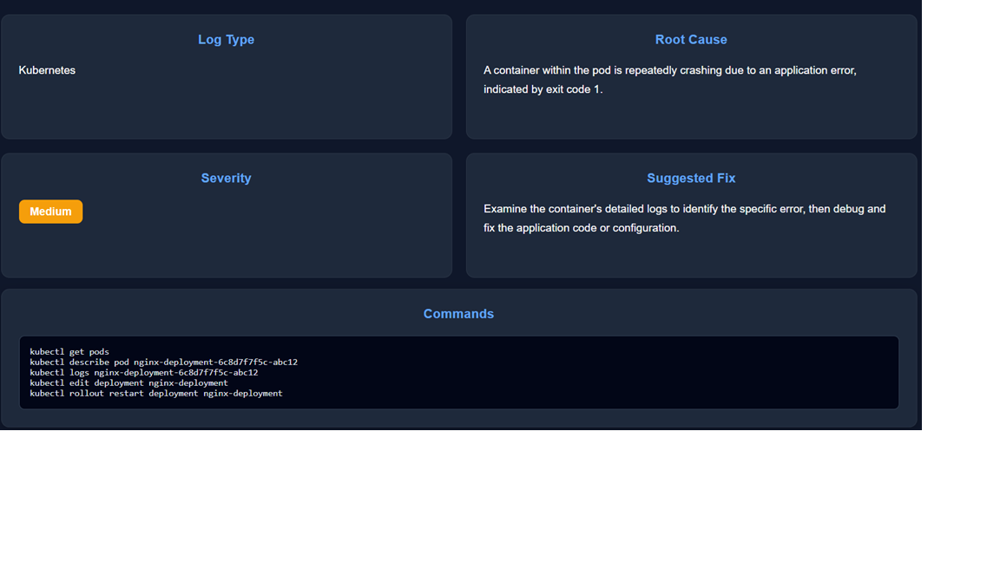

# DevOps Copilot

AI-Powered DevOps Incident Analysis Tool built using **React**, **FastAPI**, and **Google Gemini AI**.

DevOps Copilot helps DevOps engineers and cloud practitioners quickly analyze logs, identify root causes, assess severity, and generate troubleshooting commands for faster incident resolution.

---

## Overview

Modern DevOps environments generate large volumes of logs from Docker containers, Kubernetes clusters, CI/CD pipelines, cloud services, and Linux systems.

Manually analyzing these logs can be time-consuming and error-prone.

DevOps Copilot uses Generative AI to automatically:

* Detect the log source
* Identify the root cause
* Classify incident severity
* Recommend remediation steps
* Generate troubleshooting commands

---

## Features

### AI-Powered Log Analysis

Upload a log file and receive:

* Root Cause Analysis
* Severity Assessment
* Suggested Fixes
* Troubleshooting Commands

### Automatic Log Type Detection

Supports:

* Docker Logs
* Jenkins Logs
* Kubernetes Logs
* AWS Logs
* Linux/System Logs

### Severity Classification

Incidents are categorized as:

* Low
* Medium
* High
* Critical

### Modern Dashboard

Built with React and styled using a clean dark-themed interface featuring:

* Drag & Drop Upload Area
* Analysis Cards
* Severity Badges
* Command Output Section

---

## Screenshots

### Jenkins Log Analysis



### Kubernetes Log Analysis



---

## Tech Stack

### Frontend

* React
* Vite
* Axios
* CSS

### Backend

* FastAPI
* Python
* Uvicorn

### AI

* Google Gemini API

### Utilities

* Python Dotenv
* CORS Middleware

---

## Project Structure

```text
DevOps-CoPilot/
│
├── backend/
│   ├── main.py
│   ├── ai_service.py
│   ├── requirements.txt
│   ├── .env.example
│
├── frontend/
│   ├── src/
│   │   ├── App.jsx
│   │   ├── App.css
│   │   └── main.jsx
│   │
│   ├── package.json
│   └── vite.config.js
│
├── screenshots/
│   ├── Jenkins_Error_Solution.png
│   └── Kubernetes_Error_Solution.png
│
└── README.md
```

---

## How It Works

```text
Upload Log
     ↓
FastAPI Backend
     ↓
Gemini AI Analysis
     ↓
Log Type Detection
     ↓
Root Cause Analysis
     ↓
Severity Classification
     ↓
Suggested Fixes
     ↓
Troubleshooting Commands
     ↓
React Dashboard
```

---

## Sample Output

### Log Type

Kubernetes

### Root Cause

Container repeatedly crashes causing a CrashLoopBackOff state.

### Severity

High

### Suggested Fix

Inspect container logs and verify application startup configuration.

### Commands

```bash
kubectl logs <pod-name>
kubectl describe pod <pod-name>
kubectl get events
```

---

## Installation

### Clone Repository

```bash
git clone https://github.com/CoderWithSharingan/DevOps-CoPilot.git
cd DevOps-CoPilot
```

---

## Backend Setup

Navigate to backend folder:

```bash
cd backend
```

Create virtual environment:

```bash
python -m venv venv
```

Activate virtual environment:

### Windows

```bash
venv\Scripts\activate
```

### Linux / Mac

```bash
source venv/bin/activate
```

Install dependencies:

```bash
pip install -r requirements.txt
```

Create a `.env` file:

```env
GEMINI_API_KEY=YOUR_GEMINI_API_KEY
```

Run FastAPI server:

```bash
uvicorn main:app --reload
```

Backend will be available at:

```text
http://127.0.0.1:8000
```

---

## Frontend Setup

Navigate to frontend folder:

```bash
cd frontend
```

Install dependencies:

```bash
npm install
```

Start development server:

```bash
npm run dev
```

Frontend will be available at:

```text
http://localhost:5173
```

---

## Example Supported Logs

### Docker

```text
docker pull failed: access denied
```

### Jenkins

```text
ERROR: Failed to connect to Jenkins agent
```

### Kubernetes

```text
CrashLoopBackOff
```

### AWS

```text
AccessDenied: User is not authorized to perform s3:GetObject
```

### Linux

```text
Failed to start nginx.service
```

---

## Future Enhancements

* CloudWatch Integration
* Multi-Agent Analysis
* Historical Incident Tracking
* Kubernetes Cluster Diagnostics
* Jenkins Pipeline Insights
* PDF Report Generation
* Authentication & User Management
* Incident Knowledge Base

---

## Version

Current Release:

```text
v1.0
```

---
